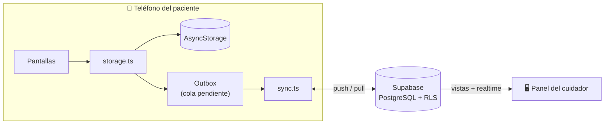

# Pastilla

Sistema de seguimiento de medicación para personas mayores que viven solas.

Dos mitades que se complementan: una **app móvil** para quien toma los
medicamentos, y un **panel web** para el familiar que se preocupa por él. El
teléfono funciona sin internet; el panel se actualiza solo cuando hay conexión.

---
LEARN-CAP-C366ADC1
## El problema

Cuando alguien mayor vive solo, la familia acaba llamando cada día para
preguntar lo mismo: «¿ya te tomaste la pastilla?». La respuesta depende de la
memoria de quien contesta, que es justo lo que falla.

Y hay un segundo problema, menos visible: nadie sabe cuántas pastillas quedan
hasta que se acaban. Reponer una receta no es inmediato, así que enterarse el
día que se agota ya es tarde.

---

## Contexto

Proyecto desarrollado para **Ozman Carias**, que necesita llevar el control de
la medicación de dos familiares mayores: su suegra y su abuela.

Ese caso real define los dos roles del sistema:

| Rol | Quién | Qué usa |
|---|---|---|
| **Paciente** | La suegra y la abuela | La app en su propio teléfono |
| **Cuidador** | Ozman | El panel web, desde cualquier navegador |

De ahí salen dos restricciones que condicionan todo el diseño:

- **La app tiene que funcionar sin internet.** No se puede asumir conexión
  estable en el teléfono de una persona mayor, y una dosis no puede quedar sin
  registrar porque se cayó la señal.
- **El cuidador no debe instalar nada.** Por eso su mitad es una página web y
  no una segunda app: se abre desde el teléfono, la computadora del trabajo o
  cualquier navegador a mano.

---

## Funcionalidades

### 1. Registro de medicamentos

Alta, edición y borrado de cada medicamento con su nombre, la hora de la toma
y la fecha de vencimiento. La pantalla principal muestra lo del día con tres
estados —pendiente, atrasado y tomado— y se marca una dosis con un solo toque.

El estado se recalcula solo: una dosis marcada ayer no sigue apareciendo como
tomada hoy.

Interfaz pensada para adultos mayores, con texto grande y alto contraste.

### 2. Manejo de inventario

Cada medicamento lleva la cuenta de pastillas restantes. Marcar una dosis
descuenta una unidad **en la misma transacción** que registra la toma, así que
el inventario nunca se desincroniza del historial. Desmarcarla la devuelve.

La fecha de vencimiento queda visible en el detalle y en el panel del cuidador.

### 3. Plataforma de monitoreo remoto

El cuidador ve, desde el navegador, el estado del día de su familiar, con lo
atrasado primero y el porcentaje de cumplimiento de los últimos 30 días. La
pantalla se actualiza sola cuando el paciente marca una dosis, sin recargar.

El acceso se concede con un código de 6 caracteres que el paciente genera en
su app y dicta por teléfono. No se comparten contraseñas ni se instala nada.

### 4. Portal privado de cuenta

En `/panel/cuenta`, el único lugar de la web donde se puede modificar algo —el
panel de monitoreo es solo lectura:

- **Datos de la cuenta:** correo y nombre visible para el resto del hogar.
- **Hogar:** nombre editable y zona horaria. El nombre importa cuando se
  acompaña a más de un familiar.
- **Quién tiene acceso:** todos los miembros del hogar con su rol.
- **Invitaciones:** generar códigos nuevos y revocar los que siguen sin usar.

Una invitación **ya canjeada no se puede borrar**: es el registro de cómo
entró un miembro al hogar, y permitir borrarla dejaría tapar ese rastro. La
regla vive en la base de datos, no en la interfaz.

---

## Estructura del repositorio

| Carpeta | Qué es | Stack |
|---|---|---|
| [`myApp/`](myApp/) | App móvil del paciente | Expo SDK 54, React Native 0.81, TypeScript |
| [`web/`](web/) | Panel del cuidador + landing pública | Vite 8, React 19, TypeScript |
| [`Migration/`](Migration/) | Esquema de base de datos y sus pruebas | PostgreSQL 15 / Supabase |
| [`.github/workflows/`](.github/workflows/) | Integración continua | GitHub Actions |

Cada carpeta tiene su propio README con el detalle.

---

## Arquitectura



El teléfono es la **fuente de verdad inmediata**. Toda escritura se aplica
primero en `AsyncStorage` y además se encola; sincronizar es un efecto de
fondo que la interfaz nunca espera.

---

## Puesta en marcha

### 1. Base de datos

Crea un proyecto en [Supabase](https://supabase.com) y ejecuta los 11 scripts
de [`Migration/`](Migration/) **en orden numérico** desde el SQL Editor. Son
idempotentes: repetirlos no rompe nada.

Después, en el dashboard: **Authentication → Sign In / Providers →
Anonymous sign-ins: ON**. El paciente entra sin registrarse, y sin esto la
sincronización no arranca.

Detalle completo en [`Migration/README.md`](Migration/README.md).

### 2. App móvil

```bash
cd myApp
npm install
cp .env.example .env.local     # rellena URL y clave anon
npx expo start --android       # o --ios
```

### 3. Panel web

```bash
cd web
npm install
cp .env.example .env.local     # los MISMOS valores, con prefijo VITE_
npm run dev
```

Los valores salen de **Project Settings → API**: *Project URL* y la clave
**`anon`**. La clave `service_role` no va en ninguno de los dos — esa sí se
salta la seguridad por completo.

---

## Cómo se conectan las dos mitades

```
1. El paciente registra sus medicinas en la app
2. Abre «Vista de cuidador» → «Invitar a un cuidador»
3. Le dicta el código de 6 caracteres a su familiar
4. El familiar entra en la web, crea su cuenta y escribe el código
5. Ya ve el estado del día, y se actualiza solo
```

El paso 4 no es un trámite: **tener cuenta no da acceso a nada**. La seguridad
a nivel de fila exige pertenecer al hogar, así que hasta canjear el código
todas las consultas devuelven cero filas.

---

## Decisiones de diseño

Cuatro elecciones explican casi todo el código.

**El estado no se guarda, se deriva.** No hay columna `status`. Persistir si
una dosis está tomada crearía una segunda fuente de verdad que se desincroniza
entre dispositivos. Se calcula al consultar.

**El historial es un log, no un campo.** `dose_events` solo añade filas. Un
único campo «última toma» se sobrescribe en cada dosis y destruye el pasado,
que es precisamente lo que el cuidador necesita consultar.

**Las fechas son del hogar, no del servidor.** Cada hogar tiene su zona
horaria. Con UTC−6, derivar el día desde UTC guardaría toda dosis tomada
después de las 6 de la tarde con la fecha del día siguiente — y el panel la
reportaría como atrasada cuando acaba de tomarse.

**Repetir una operación es seguro.** Un índice único parcial sobre las dosis
vigentes hace que un reintento por mala cobertura no descuente inventario dos
veces. Lo mismo al canjear un código: hacerlo dos veces devuelve el hogar en
vez de fallar.

---

## Integración continua

Tres flujos de trabajo, filtrados por ruta para que un cambio en una carpeta
no arrastre a las demás.

| Flujo | Qué comprueba |
|---|---|
| `ci-database.yml` | Levanta PostgreSQL 15, aplica los scripts **dos veces** y corre las pruebas de comportamiento |
| `ci-app.yml` | Tipos de la app y que el bundle de Metro resuelva |
| `ci-web.yml` | Lint y build de producción del panel |

El de base de datos es el que aporta valor real: los otros confirman que
compila, ese confirma que **se comporta**. Verifica que las dosis repetidas no
descuenten de más, que las fechas salgan de la zona horaria correcta y que un
usuario ajeno no vea ni una fila.

Las pruebas corren como rol `authenticated`, nunca como `postgres`: el
superusuario se salta la seguridad por fila, así que las pruebas de aislamiento
darían verde siempre.

---

## Despliegue

En producción en **[amelia.lat](https://amelia.lat)**, con dos direcciones que
cumplen funciones distintas:

| URL | Acceso |
|---|---|
| `https://amelia.lat` | **Pública.** Landing que explica el proyecto |
| `https://amelia.lat/panel` | **Privada.** Monitoreo del día: exige sesión y pertenecer a un hogar |
| `https://amelia.lat/panel/cuenta` | **Privada.** Gestión de la cuenta, los miembros y las invitaciones |

La segunda puerta es la que importa: autenticarse no basta. Hasta canjear un
código de invitación, la seguridad a nivel de fila devuelve cero resultados en
todas las consultas.

### Healthcheck

```
GET https://amelia.lat/api/health     →  200 si todo va bien, 503 si no
```

Devuelve JSON con el estado, el commit desplegado y la latencia de la base de
datos. No se limita a responder `{"status":"ok"}`: consulta Supabase de verdad,
porque lo que puede caerse es la base, no la función que la comprueba.

La consulta pide una fila con la clave anónima y sin sesión. Un `200` con lista
vacía confirma cuatro cosas de golpe: hay red, la API responde, la base
contesta y el aislamiento entre hogares está activo. **Si llegaran filas, el
healthcheck lo reporta como degradado** — devolver datos ahí sería una fuga.

El panel se despliega en Vercel con **Root Directory = `web`**, añadiendo
`VITE_SUPABASE_URL` y `VITE_SUPABASE_ANON_KEY` como variables de entorno.

Un detalle que se olvida siempre: en **Supabase → Authentication → URL
Configuration** hay que añadir el dominio de producción. Sin eso, los correos
de confirmación apuntan a `localhost` y el acceso queda roto en producción
aunque el despliegue se vea perfecto.

---

## Limitaciones conocidas

**El panel mezcla los hogares.** El cuidador ve una sola lista con los
medicamentos de todos los hogares a los que pertenece, sin distinguir de quién
es cada uno. En el caso de Ozman —dos familiares, por tanto dos hogares— las
medicinas de la suegra y las de la abuela aparecerían juntas y sin etiqueta.

El dato necesario ya existe: las vistas exponen `household_id`. Lo que falta es
agrupar por él en la interfaz y ofrecer un selector.

**Una sola toma diaria por medicamento.** Cada medicamento tiene una única hora
programada. Soportar «cada 8 horas» requeriría una tabla de horarios y
cambiaría el cálculo de adherencia, que hoy asume 30 dosis en 30 días.

**Sin notificaciones.** La app no avisa cuando toca una dosis: hay que abrirla
para ver qué está pendiente.

---

## Licencia y contexto

Proyecto académico de ingeniería de software. No es un producto médico y no
debe usarse como única fuente de control de una medicación real.
