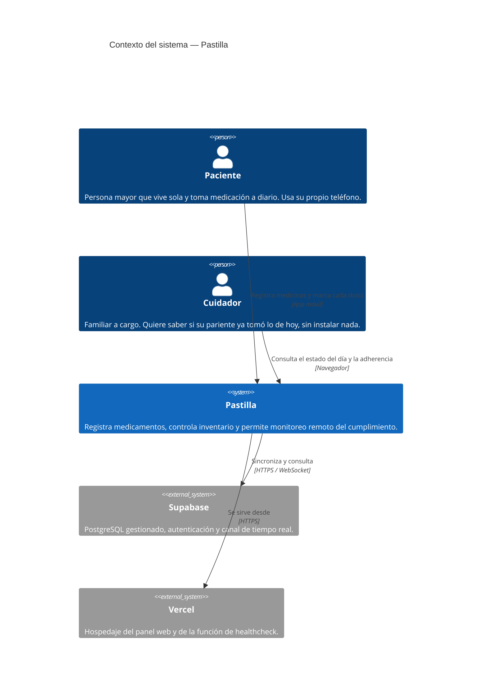
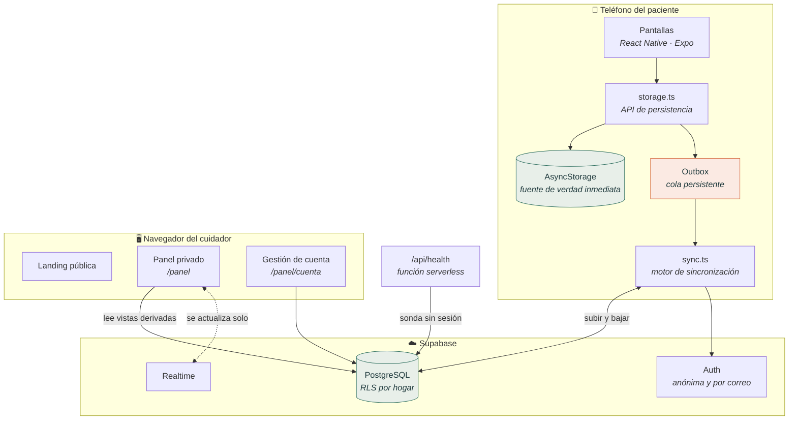
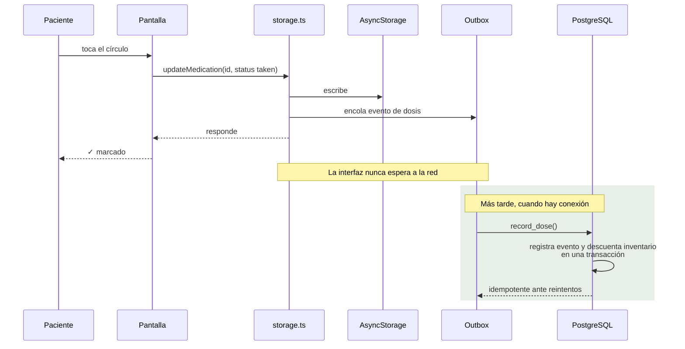
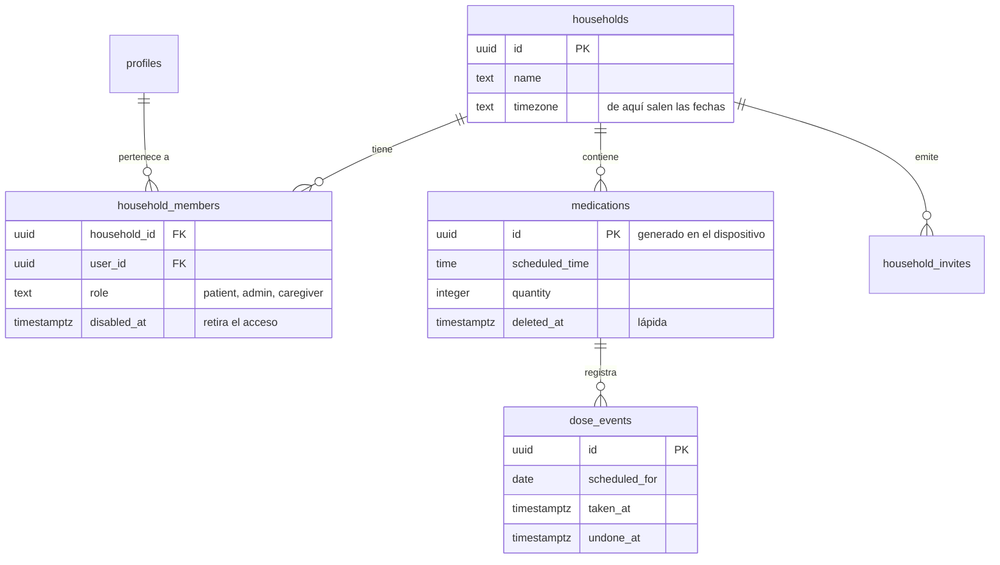

# Arquitectura — Pastilla

Documento de arquitectura del sistema de seguimiento de medicación, siguiendo
el modelo **C4** en sus dos primeros niveles.

Cliente: **Ozman Carias**, que necesita llevar el control de la medicación de
dos familiares mayores — su suegra y su abuela.

---

## Nivel 1 — Contexto del sistema

Quién usa el sistema y con qué se relaciona.

**La asimetría entre los dos actores es la que define el sistema.** El paciente
usa el teléfono a diario, puede no tener buena señal y no debería enfrentarse a
un registro ni a una contraseña. El cuidador entra desde cualquier navegador,
tiene cuenta real y solo consulta. Esa diferencia explica por qué una mitad es
app nativa y la otra una página web.

---

## Nivel 2 — Contenedores

Las piezas desplegables y cómo se comunican.

| Contenedor | Tecnología | Responsabilidad |
|---|---|---|
| App móvil | Expo SDK 54, React Native 0.81, TypeScript | Registro, marcado de dosis e inventario. Funciona sin red |
| Panel web | Vite 8, React 19, TypeScript | Consulta del estado del día y gestión de la cuenta |
| Base de datos | PostgreSQL 15 sobre Supabase | Dato compartido, reglas de acceso y estado derivado |
| Healthcheck | Función serverless en Vercel | Comprueba que la base responde y que el aislamiento sigue activo |

---

## Flujo crítico — marcar una dosis

El camino que más se ejecuta, y el que no puede fallar.

La separación entre las dos mitades es la decisión central del sistema, y está
documentada en [ADR-001](adr/ADR-001-offline-first-con-cola-de-salida.md).

---

## Modelo de datos

Dos ausencias son deliberadas: `medications` **no** guarda si la dosis está
tomada, y `dose_events` **no** se sobrescribe. El estado se deriva al
consultar y el historial solo crece.

---

## Atributos de calidad priorizados

| Atributo | Cómo se consigue | Qué se cedió |
|---|---|---|
| **Disponibilidad sin red** | Escritura local primero y cola de salida | Consistencia inmediata ([ADR-001](adr/ADR-001-offline-first-con-cola-de-salida.md)) |
| **Confidencialidad** | Reglas de acceso por fila en la base de datos | Facilidad de depuración ([ADR-002](adr/ADR-002-seguridad-en-la-base-de-datos.md)) |
| **Corrección ante reintentos** | Índice único parcial sobre las dosis vigentes | Una escritura más compleja |
| **Trazabilidad** | Nada se borra: lápidas y registros de acceso | Crecimiento de las tablas |

---

## Decisiones de arquitectura

| ADR | Decisión | Estado |
|---|---|---|
| [ADR-001](adr/ADR-001-offline-first-con-cola-de-salida.md) | Arquitectura offline-first con cola de salida en el dispositivo | Aceptada |
| [ADR-002](adr/ADR-002-seguridad-en-la-base-de-datos.md) | Seguridad a nivel de fila en la base de datos como único control de acceso | Aceptada |
